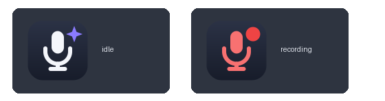

# AgentWhisper

**Push-to-talk voice dictation for Linux.** Hold a key (F12 by default),
speak, release — your words are transcribed on your own computer and
land in your clipboard, optionally typed straight into whatever you were
writing. No cloud, no account, no internet needed after setup.

**Website:** [chrisschroedinger.github.io/AgentWhisper](https://chrisschroedinger.github.io/AgentWhisper/)

> **Project status: v0.3 — deployable.** Everything in the description
> above works today: hold F12, speak, release — the text is **typed into
> whatever you were writing** and is also in your clipboard. Optional
> start-at-login, guided first-run model download, and a .deb package
> round it out. In daily use on Debian/Ubuntu with XFCE.
> See the [roadmap](#roadmap) and [CHANGELOG](CHANGELOG.md).

AgentWhisper is the from-scratch successor to
[soupawhisper](https://github.com/ChrisSchroedinger/soupawhisper) (now
archived), rebuilt around the lessons learned there — see
[DESIGN.md](DESIGN.md) if you care about the engineering.

## What it looks like

A **microphone icon in your system tray** — right-click it for the menu.
It turns red while recording:



While recording, a small translucent panel floats near the bottom of
your screen with **green bars dancing to your voice** — so you always
know when the microphone is live:


## Requirements

- Linux with **X11** (not Wayland). Built and tested on
  **Debian/Ubuntu with XFCE**; any Debian-family desktop should work.
- **Python 3.11 or newer** (your distro's regular Python).
- A microphone.
- A few small system packages (tray icon, typing, clipboard,
  notifications) — most are preinstalled on XFCE:

  ```bash
  sudo apt install python3-gi python3-gi-cairo gir1.2-ayatanaappindicator3-0.1 \
                   xclip xdotool libnotify-bin
  ```

## Install

No root access needed except for the apt line above — everything else
goes into your home directory.

```bash
# 1. Get the code
git clone https://github.com/ChrisSchroedinger/agentwhisper.git
cd agentwhisper

# 2. Install uv (a fast Python package manager) — once, if you don't have it
curl -LsSf https://astral.sh/uv/install.sh | sh

# 3. Install AgentWhisper
./install.sh
```

The installer creates a private Python environment, puts **AgentWhisper
in your applications menu** (Utility category), adds the `agentwhisper`
command to your terminal, and tells you clearly if anything is missing.

To remove everything again: `./uninstall.sh` (add `--purge` to also
delete your settings and logs).

**Alternative: .deb package** (system-wide, for Debian/Ubuntu):

```bash
./build-deb.sh
sudo apt install ./dist/agentwhisper_*.deb
```

Pick one method or the other, not both.

## Using it

Start **AgentWhisper** from your applications menu. The mic icon appears
in the tray.

**Two ways to record** (switch anytime in the tray menu → *Recording Mode*):

| Mode | How it works |
|------|--------------|
| **Hold to talk** (default) | Hold F12, speak, release. |
| **Press to toggle** | Press F12 to start, press F12 again to stop. |

When you stop, the tray shows *Transcribing…* for a moment, then the
text is **typed straight into the window you're working in** and placed
in your clipboard as backup. A small notification confirms it (with a
preview of what was heard). Prefer paste-only? Turn off *Auto-Type* in
the tray menu — then it's clipboard + Ctrl+V.

> **First run:** the speech model (~140MB for the default) downloads
> automatically in the background when AgentWhisper starts. The tray
> status line and `agentwhisper status` show the **live download
> percentage**; dictations made before it finishes are queued.

While AgentWhisper runs, **F12 belongs to it alone** — other programs
won't see the key, so it can't accidentally trigger something else.
(Combinations like Ctrl+F12 keep working normally.)

**The tray menu** (right-click the icon):

- a status line telling you what to do in the current mode (and the
  model download progress on first run)
- **Enabled** — pause/resume dictation without quitting
- **Auto-Type into active window** — on: text is typed for you;
  off: clipboard only
- **Notifications** — the "Typed & copied" confirmations on/off
- **Start at login** — AgentWhisper starts with your session
- **Recording Mode** — hold-to-talk vs. press-to-toggle
- **Recording Limit** — how long one recording may run at most
  (30 seconds to 10 minutes), so a stuck key can't record forever
- **Dictate into one window…** — click any window once, and every
  dictation is then typed into *that* window and submitted with Enter,
  no matter where you're working (see below)
- **Quit AgentWhisper**

**Talking to an AI agent:** choose *Dictate into one window…*, click
your agent's terminal once, and from then on you can dictate from
anywhere — each recording is typed into that window and sent with
Enter, hands-free. The window is raised each time and the clipboard
still gets a copy. Click the same menu item (*Stop dictating into: …*)
to go back to normal, or just close the window — AgentWhisper notices
and tells you. The choice isn't remembered across restarts.

**From the terminal** (optional, same controls):

```bash
agentwhisper status    # is it running? what's it doing?
agentwhisper toggle    # enable/disable dictation
agentwhisper mode toggle   # or: hold
agentwhisper limit 120     # max seconds per recording (30-600)
agentwhisper target choose # send every dictation to one window (or: clear)
agentwhisper autostart on  # start with your session (or: off)
agentwhisper quit
```

## Settings

Settings live in `~/.config/agentwhisper/config.toml` (created on first
run, with comments). The interesting ones:

| Setting | Default | Meaning |
|---------|---------|---------|
| `key` | `f12` | The push-to-talk key (`f1`…`f12`, `scroll_lock`, `pause`, …) |
| `mode` | `hold` | `hold` = push-to-talk, `toggle` = press to start/stop |
| `model` | `base.en` | Whisper model: `tiny.en` (fastest) … `medium.en` (most accurate) |
| `auto_type` | `true` | Type the text into the active window (besides copying it) |
| `notifications` | `true` | Desktop notification after each dictation |
| `max_record_seconds` | `60` | Safety cap on a single recording (`30`–`600`) |

Restart AgentWhisper after editing the file. (Mode and the recording
limit can also be changed live from the tray.)

## Troubleshooting

**No tray icon?** Run `agentwhisper status` — the `tray:` line tells you
why, and the fix is always the apt command from
[Requirements](#requirements), followed by re-running `./install.sh`.

**"could not reserve 'f12'"?** Another program grabbed exactly that key.
Press F12 and see what reacts, then either unbind it there or pick a
different key in the config file.

**No green bars while recording?** Check `agentwhisper status` →
`visualizer:`. If unavailable, install `python3-gi-cairo` and restart.

**Dictated but no text appeared?** Check `agentwhisper status`:
`engine:` must say `ready` (`loading` means the model is still
downloading — first run only), and `desktop:` must say `ok` (if not, it
names the missing tool and the apt command). Very short taps (under
~0.3s) are ignored on purpose, and silence transcribes to nothing.
If typing fails the text is still in your clipboard — Ctrl+V.

**Where are the logs?** `~/.local/state/agentwhisper/daemon.log`.

## Roadmap

| Milestone | Status |
|-----------|:------:|
| 1. Installs, runs once, tray icon + menu | ✅ done |
| 2. Records: exclusive hotkey, mic capture, voice visualizer | ✅ done |
| 3. Transcribes: speech → text in your clipboard (English) | ✅ done |
| 4. Types the text into the active window + notifications | ✅ done |
| 5. Polish: autostart, easy model download, .deb package | ✅ done |
| 6. AppImage package (single-file, distro-independent) | planned |
| Later: more languages, Wayland, agent mode | designed for |

## For developers

```bash
./install.sh       # sets up the venv (needs system Python + GTK bindings)
uv run pytest      # 59 tests
uv run ruff check .
```

Architecture, decisions, and rationale: [DESIGN.md](DESIGN.md).

## License

[MIT](LICENSE) — © 2026 Chris Schroedinger
